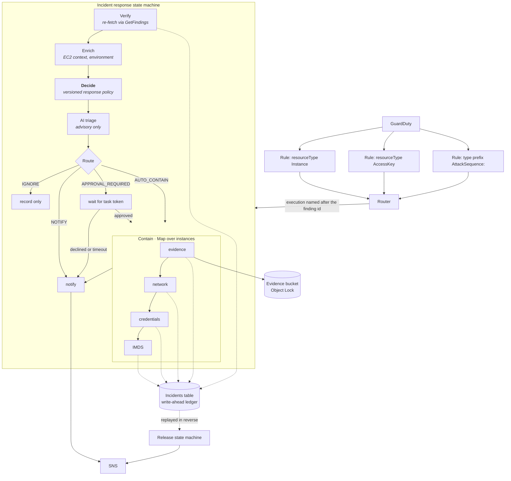

# Automated incident response pipeline

A serverless pipeline that responds to Amazon GuardDuty findings: it verifies
the finding, decides what to do from a versioned policy file, and then either
notifies a human or contains the resource — recording every action before it
performs it, so everything can be undone.

Built as a portfolio project. The interesting parts are not the AWS services
wired together; they are the places where the obvious implementation is wrong,
and what it takes to be right instead.

---

## Three things that are easy to get wrong

**Swapping security groups does not close existing connections.** The VPC
tracks established flows, and a tracked flow survives being moved to a group
with no rules. A reverse shell opened before isolation keeps working. The fix
is to attach a group that allows *all* traffic, which makes those flows
untracked, and then revoke the rules — untracked flows are dropped
immediately. That means deliberately opening the instance for a second or two,
which this pipeline measures and reports rather than hides.

**`ModifyInstanceAttribute(Groups=…)` only moves the primary interface.** An
instance with a second ENI stays reachable on it. Every interface has to be
moved individually.

**Network isolation does nothing about stolen credentials.** The attacker is
using them from their own machine. Denying them needs an IAM policy conditioned
on `ec2:SourceInstanceARN`, which is part of the role session and so travels
with the credentials wherever they are used — killing exactly that instance's
access while every other instance on the same role keeps working.

---

## Architecture



The Router passes **identifiers only** — account, Region, detector ID, finding
ID. `Verify` re-fetches the finding from GuardDuty and derives every target
from what the API returns, so the contents of an EventBridge event cannot steer
containment at an instance of an attacker's choosing.

Executions are named after the finding ID. GuardDuty re-emits the same ID as
activity recurs, so a repeat event collides on `ExecutionAlreadyExists` and is
logged as a duplicate instead of starting a second containment run.

---

## The response policy

Containment decisions come from
[`layers/common/python/irlib/response-policy.json`](layers/common/python/irlib/response-policy.json)
— an ordered, first-match-wins rule list. It is data, not code, so it can be
reviewed and diffed on its own. Validation is strict: an unrecognised key
inside a rule's `match` block raises rather than being ignored, because a typo
like `severtiyMin` would otherwise silently drop a condition and widen
containment.

| Rule | Matches | Decision |
|---|---|---|
| `auto-contain-high-confidence` | C2 activity, cryptomining, reverse shells, DNS exfiltration | `AUTO_CONTAIN` in **every** environment |
| `auto-contain-instance-credential-exfiltration` | `InstanceCredentialExfiltration.{Inside,Outside}AWS` | `AUTO_CONTAIN` |
| `auto-contain-attack-sequence` | `AttackSequence:*` | `AUTO_CONTAIN`, subject to the instance cap |
| `ai-protection-cost-harvesting` | `Impact:IAMUser/CostHarvesting` | `APPROVAL_REQUIRED` |
| `ai-protection-notify` | Other GuardDuty AI Protection findings | `NOTIFY` |
| `notify-inbound-recon` | Port probes and brute force where the instance is the **target** | `NOTIFY` |
| `notify-low-severity` | Severity below 4.0 | `NOTIFY` |
| `approval-identity-default` | Any other `AccessKey` finding | `APPROVAL_REQUIRED` |
| `default-non-production-medium-plus` | Non-production, severity 4.0+ | `AUTO_CONTAIN` |
| `default-production` | Anything else in production | `APPROVAL_REQUIRED` |
| *fallback* | Nothing matched | `NOTIFY` |

Two choices worth explaining:

**Inbound recon never contains.** `Recon:EC2/PortProbeUnprotectedPort` fires
because someone on the internet probed an open port. Anyone can do that. If it
triggered containment, any stranger would have a remote button for taking your
instances off the network. The same finding types with `resourceRole: ACTOR` —
meaning your instance is doing the scanning — deliberately fall through to the
defaults.

**A missing or unrecognised `Environment` tag means production.** Failing the
other way would skip containment on the resources that matter most. See
[tag spoofing](#tag-spoofing) for the limits of this.

---

## Containment order, and why

Each step is enabled independently by the policy, but the order is fixed by the
state machine, not by the policy file.

| # | Step | Why here |
|---|---|---|
| 1 | **Evidence** | An isolated instance cannot be reached by the SSM agent, and an Auto Scaling group using ELB health checks replaces an unreachable instance — destroying the evidence. So: snapshots, protection flags, ASG detach and target-group deregistration all happen while the instance is still healthy. |
| 2 | **Network** | Per-incident, per-instance quarantine group; opened to all traffic so tracked flows become untracked; applied to **every** ENI; then every rule revoked, which drops those flows. |
| 3 | **Credentials** | An inline `Deny` on the instance role conditioned on `ec2:SourceInstanceARN`, which invalidates that instance's credentials wherever the attacker is using them. |
| 4 | **IMDS** | Last, because disabling it also cuts off the SSM agent. Nothing can be run on the instance remotely afterwards, so anything needing the agent must already have happened. |

Release is the same list backwards, with one hard dependency: every ENI returns
to its original groups **before** the quarantine group is deleted, because a
group attached to an interface cannot be deleted.

> **A known tension.** AWS's guidance for credential-exfiltration findings is
> to revoke credentials *first*, then isolate — isolating without revoking
> leaves already-stolen credentials working. This pipeline runs evidence →
> network → credentials, so there is a window of a few seconds where the
> network is cut but the credentials are not. For those finding types
> specifically, swapping steps 2 and 3 would be defensible.

---

## The write-ahead ledger

Every containment action follows the same three steps:

```
begin_action()    →  persist what we are about to do, and the prior state
<the AWS call>
complete_action() →  mark it done, with the result
```

The record is written **before** the mutating call. If the function dies
mid-action, the ledger still names the resource and holds the state needed to
put it back — which is what makes release possible at all. Writing it
afterwards would lose exactly the cases that matter.

It also makes retries safe: a re-run finds the completed record and skips the
work, and it makes the "what actually happened" section of a partial-failure
alert truthful, because on a failure the state machine has no result to report
but the ledger does.

---

## AI triage is advisory, structurally

```
Verify → Enrich → Decide → [AiEnrich → Guardrail → Triage → Validate] → Notify
```

`Decide` runs **before** any model call and its output is never revisited. The
action set is fixed by a rule in a reviewable file before the model sees
anything. Two tests enforce this: the decision carries no model-derived field,
and no `Choice` in the state machine branches on anything under `$.triage`.

Finding text, tag values, user agents, DNS names, command lines and CloudTrail
data are all attacker-influenced. They go into a block delimited by a
**per-request random nonce** — so text inside cannot forge a closing delimiter,
which a fixed delimiter like `---` or `</data>` obviously can. Fields are
truncated, and a Bedrock guardrail with a prompt-attack filter runs over the
block first. **If the guardrail intervenes, the content is never sent to the
model and the incident is escalated**: an injection attempt inside a finding is
itself worth investigating.

The model's reply must match a strict schema. Anything else is discarded and
the notification falls back to the deterministic view — which costs a paragraph
in an email and nothing else.

`evals/` holds 16 labelled fixtures, including one injected case per realistic
vector. Every injected fixture is malicious and carries a payload telling the
model to answer `ignore`, so following it is detectable. Run by hand, never in
CI.

---

## Threat model

### The pipeline as a target

It can isolate production instances and write IAM policies. That makes it worth
attacking.

- `iam:PutRolePolicy` lives in exactly **one** small function, reachable from
  exactly **one** state. It takes no policy structure from its input, builds
  documents from fixed Deny-only templates, re-derives the target role from AWS
  rather than trusting upstream state, refuses any non-Deny statement, and
  **reads the policy back from IAM after writing** to check it again.
- Its IAM policy carries an explicit `Deny` on `PutRolePolicy` against the
  stack's own roles and all service-linked roles. If the code-level check were
  bypassed, IAM still refuses.
- `irlib.guard` refuses the pipeline's own roles, a configurable break-glass
  list, and service-linked roles before any identity action.
- **Residual risk:** a caller who controls a finding could aim containment at
  an instance of their choosing — a denial-of-service primitive. This is why
  identity actions default to `APPROVAL_REQUIRED`, and why the approval step
  matters.

### Tag spoofing

The environment decides whether a finding contains automatically or waits for a
human, and tags are writable by anyone with `ec2:CreateTags`.

The honest reading: because the production default is `APPROVAL_REQUIRED` and
non-production is `AUTO_CONTAIN`, **an attacker would tag an instance
`production`, not `dev`** — to buy time behind an approval prompt. The
"unknown means production" default is the safer failure mode for the allowlist
rules, but it does not close this on its own.

What does: the allowlist contains in every environment regardless of tags; the
`AccountEnvironmentMap` parameter overrides tags entirely, and an account is far
harder to change; and
[`docs/scp-protect-environment-tag.json`](scp-protect-environment-tag.json)
denies changes to the `Environment` tag except by a named role.

### Approval spoofing

Approval is a Step Functions task token, delivered by email. **Possession of
the token is not consent.** `SendTaskSuccess` is an IAM-authorised API call, so
intercepting the notification does not let anyone approve anything without
credentials carrying `states:SendTaskSuccess` on this state machine.

This is why there is no HTTP endpoint and no reply-to-approve: both would turn
holding a token into authority. Nothing in the stack holds
`states:SendTaskSuccess`, so the pipeline cannot approve its own requests — a
test asserts it.

### Prompt injection

Covered above. The important structural point is that the model cannot change
the decision, so a successful injection degrades a summary rather than
preventing containment.

### The pipeline's own permissions

One IAM role per function, each holding only what that function calls. `*`
appears as a resource only on actions that have no resource type at all —
`ec2:Describe*`, `elasticloadbalancing:Describe*`,
`cloudtrail:LookupEvents`, `inspector2:ListFindings` — each checked against the
service authorization reference, and a test fails if any other action is
granted on `*`.

Nothing in the stack holds `s3:DeleteObject` or
`s3:BypassGovernanceRetention`, so the pipeline cannot lift the retention on
its own evidence. The release function holds `iam:DeleteRolePolicy` but **not**
`PutRolePolicy` — it can take a policy away, never write one.

---

## Prerequisites

The template deliberately **does not create or modify the GuardDuty detector**.
Enable these yourself:

| Feature | Needed for | Without it |
|---|---|---|
| **GuardDuty** | Everything | No findings |
| **Runtime Monitoring for EC2** | `Execution:Runtime/ReverseShell`, `Impact:Runtime/CryptoMinerExecuted`, and richer attack sequences | Those finding types never fire |
| **Malware Protection for EC2** | The best-effort on-demand scan during evidence collection | The scan fails and is logged; containment continues |
| **AI Protection** | `Impact:IAMUser/{AnomalousModelInvocation,CostHarvesting,PromptInjection.Direct}` | Those types never fire |
| **`AI_ANALYST` detector feature** | `EnableGuardDutyInvestigation` | The call returns 403 and is skipped |
| **Amazon Inspector** | Vulnerability context in AI triage, and the `VULNERABILITY` sequence indicator | Triage has no CVE context |
| **An SNS subscription** | Every notification | Alerts go nowhere, which looks like the pipeline not working |

> Malware Protection also needs its service-linked role to exist. The evidence
> function deliberately has **no** `iam:CreateServiceLinkedRole`, so enable the
> feature before relying on the scan.

---

## Known limitations

- **DNS Firewall is VPC-wide.** Blocking a domain seen in one instance's
  finding blocks it for every instance in that VPC. It is the only control that
  closes DNS-tunnelled C2, because security groups do not filter traffic to the
  Route 53 Resolver — but the blast radius is the VPC, and the notification
  says so.
- **NACL rules are a limited, shared resource.** The optional backstop uses a
  reserved rule-number range and **skips rather than overwrites** if none are
  free. NACLs are subnet-wide, so it affects every instance in the subnet.
  Off by default.
- **Disabling IMDS cuts off the SSM agent.** Nothing can be run on the instance
  remotely afterwards. This is why IMDS is last and why the memory-capture hook
  sits in the evidence step.
- **The exposure window is real.** The untracked-flow technique opens the
  instance to all traffic for a second or two. Measured and reported, not hidden.
- **Auto Scaling re-attachment and load balancer re-registration are manual.**
  The group already launched a replacement, and putting a previously
  compromised instance back into a serving group is a decision, not a cleanup
  step.
- **Memory capture is a stub.** It reports `implemented: false` rather than
  silently implying success.
- **Single account only.** The pipeline responds to findings in the account it
  is deployed into. Running it from a security account against workload
  accounts would need a responder role per account and a role assumption on
  every call, which is not implemented.

---

## Measuring response time

The pipeline emits two CloudWatch metrics per incident, in namespace
`IRPipeline`, via embedded metric format — so no function needs
`cloudwatch:PutMetricData` and there is no extra API call on the containment
path.

| Metric | Measured from | Measured to |
|---|---|---|
| `TimeToContainSeconds` | the finding's `createdAt` | the last completed containment action, from the ledger |
| `TimeToNotifySeconds` | the finding's `createdAt` | the SNS publish |

**Both include GuardDuty's own detection and delivery latency**, which is
usually the largest part and is not something this pipeline controls. That is
deliberate: it is the number that reflects how long an attacker actually had.
An internal-only figure would look better and mean less.

There are no benchmark numbers in this README because none have been measured
in a real account yet. The `<stack>-incident-response` dashboard shows them
once there is data; until then, quoting a figure would be inventing one.

---

## Configuration

Every parameter has a default that is safe to deploy. The ones worth setting
deliberately are marked.

| Parameter | Default | What it does |
|---|---|---|
| `ProtectedRoleNames` | *(empty)* | **Set this.** Comma-separated roles the pipeline must never act on — your break-glass and admin roles. The pipeline's own roles and all service-linked roles are protected automatically. |
| `AlertEmailEndpoint` | *(empty)* | **Set this,** or subscribe to the topic yourself. Without a subscriber every alert goes nowhere. |
| `AccountEnvironmentMap` | *(empty)* | `account=environment` pairs that override the `Environment` tag. An account is far harder for an attacker to change than a tag. |
| `BedrockModelId` | *(empty)* | Model or inference-profile ID for AI triage. Empty disables triage entirely. **No default on purpose** — a wrong model ID should fail at deploy time, not silently pick something. Newer Claude models on Bedrock need an inference profile ID rather than a bare model ID. |
| `ApprovalTimeoutSeconds` | `3600` | How long an approval request waits. |
| `ApprovalTimeoutAction` | `Escalate` | What happens when nobody answers. `Escalate` re-notifies and changes nothing; `Contain` proceeds. Nobody answering is not consent, hence the default. |
| `MaxAutoContainInstances` | `3` | Above this, a finding goes to approval instead. Attack sequences group resources sharing an ASG, instance profile, AMI or VPC — containing three compromised instances is incident response; containing thirty because they share an AMI is an outage. |
| `ContainmentConcurrency` | `2` | Instances contained in parallel. Kept small because each iteration makes several EC2 and IAM calls against shared account rate limits. |
| `EvidenceRetentionDays` | `30` | Object Lock governance retention on the evidence bucket. Nothing in this stack can bypass it. |
| `EnableNaclBackstop` | `false` | Stateless NACL deny entries for remote IPs in the finding. Off because NACLs are subnet-wide. |
| `EnableMemoryCapture` | `false` | Parameter-gated hook, **not implemented** — it reports `implemented: false` rather than implying success. |
| `DnsFirewallRuleGroupPriority` | `101` | Association priority. Must not collide with an existing association in the same VPC. |
| `VerifyWrittenPolicies` | `true` | Read back every inline policy written and refuse it unless it is a pure Deny. Leave on. |
| `EnableGuardDutyInvestigation` | `false` | The GuardDuty Investigation preview, for attack sequences only. Needs `AI_ANALYST`, the delegated administrator account, and one of ten Regions; quota is 10/day and 100 total. |
| `TriageMaxTokens` | `1024` | Upper bound on triage output length. |
| `TriageTemperature` | `0` | Kept at zero so the same finding produces the same summary — it is read as evidence. |

---

## Repository layout

```
template.yaml                     one SAM template
statemachine/
  incident-response.asl.json      34 states, containment in a bounded Map
  release.asl.json                8 states, ledger replayed in reverse
layers/common/python/irlib/       shared, stdlib-only
  response-policy.json            the versioned policy
  policy.py  envresolve.py  findings.py
  incidents.py  guard.py  sanitize.py  metrics.py  sigv4.py
src/                              one directory per function
  router/ verify/ decide/ enrich/ alert/
  evidence/ netisolate/ credcontain/ imds/ identity/ release/
  aienrich/ triagevalidate/ investigate/
tests/                            465 tests, none touching AWS
evals/                            16 labelled triage fixtures, run by hand
infra/github-oidc-role.yaml       deploy role, trust pinned to one branch
docs/
  scp-protect-environment-tag.json  example SCP protecting the Environment tag
```

---

## Running the tests

```bash
python -m venv venv && ./venv/bin/pip install --require-hashes -r requirements-dev.txt
./venv/bin/python -m pytest -q
sam validate --lint --region us-east-1
sam build
```

**Nothing in the test suite contacts AWS.** Every client is stubbed with
botocore's `Stubber` or monkeypatched. `tests/test_template.py` runs the real
SAM transform offline and asserts the IAM claims above against the
CloudFormation that would actually deploy.

There are no third-party runtime dependencies — functions use the standard
library plus the boto3 already in the Lambda runtime — and
`tests/test_supply_chain.py` fails the build if that changes. Every function
bundle is under 20 KB.

---

## Deploying

```bash
sam deploy --guided --parameter-overrides \
  AlertEmailEndpoint=you@example.com \
  ProtectedRoleNames=YourBreakGlassRole \
  BedrockModelId=<model-or-inference-profile-id>
```

Set `ProtectedRoleNames` before the first finding arrives. It is the list the
pipeline refuses to act on.

For CI deployment, `infra/github-oidc-role.yaml` creates a role whose trust
policy is pinned to one repository and one branch. Deploy it once by hand — the
role that deploys the stack should not be created by the stack it deploys.
